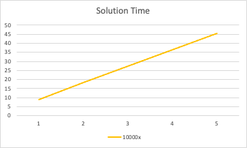

# GPU profiling based on N-body problem

## N-body problem
- There is a simple direct n 2 N-body algorithm, where each particle (or body) exerts a force on all other particles that is inversely proportion to the square of their separation distance. At each timestep, the net force on each particle is computed, yielding its instantaneous acceleration, which can then be used to estimate its velocity at the next timestep (using a discrete value of time and the previous velocity). The key point is that N-body is much closer to a realistic computational kernel than some of the loop structures.

## Introduction
- There are six versions of a simple N-body code – a serial CPU implementation, a multicore CPU implementation, and four slightly different GPU implementations. 
- The four GPU implementations carry out identical computations but include data layout and/or operation order optimizations (CUDA etc.). I analyzed these codes related performance.

## Report
1. **Run each version of the code (n = 100, 000 and 20 timesteps  (iterations)). For the CPU use `gcc -O2`. At least 5 executions. Used a dedicated (exclusive) partition.**
    
    
    | N_body = 100000 |  |  |  |  |  |  |
    | --- | --- | --- | --- | --- | --- | --- |
    | Metric\Code | Serial | Multicore | GPU1 | GPU2 | GPU3 | GPU4 |
    | Time to solution - tottime | 909.882345 | 21.118283 | 0.446659 | 0.449543 | 0.461263 | 0.442049 |
    | Grind rate (time/iteration) - avgtime | 47.888544 | 1.006225 | 0.023508 | 0.02366 | 0.024277 | 0.023266 |
    | PAPI_SP_OPS - total | 3610022800000 | 1732909440000  |  |  |  |  |
    | PAPI_TOT_CYC - total | 2723233133544 | 2919132500208  |  |  |  |  |
    | GFLOP/s | 3.967570994 | 82.05730741 |  |  |  |  |
    | FLOP/cycle | 1.33 | 0.59  |  |  |  |  |
    | bodyForce - total | 909.878969 | 21.109205 |  |  |  |  |
    | % time in bodyForce() | 99.9996% | 99.96% |  |  |  |  |
    | Cores | 1 | 48 |  |  |  |  |
    | Clock rate - 3 GHz - 3000 MHz | 3 | 3 |  |  |  |  |
    | Peak theoretical performance | 3.976915625 | 85.48394406 |  |  |  |  |
    | % of peak obtained | 99.77% | 95.99% |  |  |  |  |
    - We can GPU performances much better than CPU, because the n body simulation has SIMD feature.
    - The fastest configure as I found is:
        
        
        | Metric\Code | Serial | Multicore | GPU1 | GPU2 | GPU3 | GPU4 |
        | --- | --- | --- | --- | --- | --- | --- |
        | thread | 1 | 48 | 2 | 12 | 12 | 12 |
    - However, the `PAPI_SP_OPS` cannot count the FLOPs in GPU. I use `nvprof -m flop_sp_efficiency -m flop_count_sp ./nbody_gpu1` command to generate the GPU report. I guess it is due to that it should count the FLOPs and generate report, the speed becomes much lower. The results are:
        
        
        | Metric\Code | GPU1 | GPU2 | GPU3 | GPU4 |
        | --- | --- | --- | --- | --- |
        | Time to solution - tottime | 68.144497 | 66.961731 | 67.024531 | 67.028522 |
        | Grind rate (time/iteration) - avgtime | 3.586552474 | 3.524301632 | 3.527606895 | 3.527816947 |
        | Floating Point Operations(Single Precision) | 1.7E+11 | 1.70E+11 | 1.70E+11 | 1.70E+11 |
        | GFLOP/s | 2.49 | 2.538763522 | 2.538771961 | 2.538620798 |
        | bodyForce - total | 68.134491 | 65.963431 | 67.003571 | 66.927596 |
        | % time in bodyForce() | 99.9853% | 98.5091% | 99.9687% | 99.8494% |
        | Peak theoretical performance | 4.576589387 | 4.618452832 | 4.486255453 | 4.489161446 |
        | % of peak obtained (FLOP Efficienc - Peak Single) | 54.51% | 54.97% | 56.59% | 56.55% |
    
2. **Time complexity of the main loop (big-O notation)**
    - nbody_cpu_multicore.c
        
        The time complexity of the main loop in the given code is O(nBodies * nIters). This is because the loop iterates nIters times, and for each iteration, it performs operations that depend on the number of bodies (nBodies).
        
        Then the most significant operation within the loop is the **`bodyForce`** function. It has a nested loop that iterates over nBodies twice, resulting in a time complexity of O(nBodies^2). 
        
        Therefore, the overall time complexity of the main loop is O(nIters * (nBodies + nBodies^2))= O(nBodies^2 * nIters)
        
    - To verify the analysis, I plot the execution time versus the problem size (nBodies) for a fixed number of iterations (nIters). Vary the problem size and measure the execution time for each size.
        
        
        | N-bodies | Time to solution | Time to solution / body number | 10000x |
        | --- | --- | --- | --- |
        | 10000 | 9.087464 | 0.000908746 | 9.087464 |
        | 20000 | 36.347656 | 0.001817383 | 18.173828 |
        | 30000 | 81.782549 | 0.002726085 | 27.26085 |
        | 40000 | 145.69876 | 0.003642469 | 36.42469 |
        | 50000 | 227.622501 | 0.00455245 | 45.5245 |
        
        
        

2. **Arithmetic intensity (estimated) of the main bodyForce loop in FLOPs per word**
    - Within the loop, the following operations are performed.
    - Memory reads: Each iteration reads the `x`, `y`, `z` coordinates of the `i`-th body and the `x`, `y`, `z` coordinates of the `j`-th body. This amounts to reading 6 words per iteration.
    - Floating-point operations: Each iteration performs 15 floating-point operations (3 multiplications and 12 additions).
        
        Memory writes: Each iteration writes the updated velocity components (**`vx`**, **`vy`**, **`vz`**) of the **`i`**th body. This amounts to writing 3 words per iteration.
        
    - Based on the above analysis, the arithmetic intensity of the **`bodyForce`** loop can be calculated as:
        
        ```bash
        Arithmetic Intensity = FLOPs / Words
        = 15 FLOPs / (6 words + 3 words)
        = 15 FLOPs / 9 words
        = 1.67 FLOPs/word
        ```
        
    - This calculation assumes that all memory accesses are fulfilled from the L1 cache. The actual performance may vary based on the efficiency of memory accesses, caching, and other factors specific to the architecture.
    - The measured FLOP/s in serial CPU is 1.33, which is near the measured value. It means the calculating process is correct.
    
2. **Maximum GPU speedup relative to the CPU**
    - From the table in Q1, we can see the leak EXE_Time_GPU is 0.44, and the EXE_Time_CPU (multicore) is 909.
    - Therefore, we have:
    
    ```bash
    Speedup = EXE_Time_CPU / EXE_Time_GPU
    				= 21.11 / 0.44
    				= 47.97
    ```
    
3. **Amdahl Ceiling**
    - From table in Q1, we can calculate:
    
    ```bash
    P (Percentage of BodyForce) = 99.9996%
    N (Number of Cores) = 48
    Amdahl ceiling = 1 / [(1 - P) + (P / 48)] = 32.65
    ```
    
    - If n = 500,000, when we rerun the cpu_serial, we can have:
    
    ```bash
    P (Percentage of BodyForce) = 0.999986 * 100%
    N (Number of Cores) = 48
    Amdahl ceiling = 1 / [(1 - P) + (P / 48)] = 47.6862246419
    ```
    
4. **The serial code is compute or memory bound**
    - I used the `PAPI_STL_CCY` (Cycles with no instructions completed), and `PAPI_TOT_CYC` (Total cycles). If we can get a comparatively high ratio of cycles with no instructions (i.e. `PAPI_STL_CCY` / `PAPI_TOT_CYC`), then it would indicate a memory bound routine. Otherwise, it will illustrates a cpu bound routine.
    - I use the args as n = 1000000, and can get the result as:
    
    ```bash
    Ratio = PAPI_STL_CCY / PAPI_TOT_CYC
    			= 983201352686 / 2723004881194
    			= 36%
    ```
    
    - We can see roughly 36% stalled cycles. The serial code is compute-bound instead of memory-bound. We can see improvement if clock speed were increased.
    
5. **CPU performance using the Intel compiler**
    - I used command below to use the Intel compiler and generate related report
    
    ```bash
    icc -O2 -qopenmp nbody_cpu_multicore.c timer.c -o nbody_cpu_multicore_intel -lpapi -lm -qopt-report-phase=vec -qopt-report=1
    icc -O2 -qopenmp nbody_cpu_serial.c timer.c -o nbody_cpu_serial_intel -lpapi -lm -qopt-report-phase=vec -qopt-report=1
    ```
    
    - The results are:
        
        
        | Metric\Code | Serial (gcc) | Serial (intel) |
        | --- | --- | --- |
        | Time to solution - tottime | 909.882345 | 265.523282 |
        | Grind rate (time/iteration) - avgtime | 47.888544 | 13.97491 |
        | GFLOP/s | 3.967570994 | 16.45826033 |
        | % time in bodyForce() | 99.9996% | 99.9990% |
        | Peak theoretical performance | 3.976915625 | 18.37831545 |
        | % of peak obtained | 99.77% | 89.55% |
    - I used `icc` . The Intel compiler is known for its advanced optimizations tailored for Intel processors. When using the Intel compiler, we can expect it to leverage specific processor features, vectorization, and other optimizations to potentially improve code performance.
    - The gap of execution time between cpu_serial is significant. Due to that the Intel compiler incorporates advanced optimization techniques, such as auto-vectorization, loop unrolling, and memory access optimizations. I guess the `-O2` command in `gcc` didn’t work. It means that the code is non-vectorized after `gcc` compilation.
    
6. **Intel compiler report (vectorized and non-vectorized)**
    - serial-cpu (with vectorization)  output file is:
        
        ```bash
        Intel(R) Advisor can now assist with vectorization and show optimization
          report messages with your source code.
        See "https://software.intel.com/en-us/intel-advisor-xe" for details.
        
        Begin optimization report for: main(const int, const char **)
        
            Report from: Vector optimizations [vec]
        
        LOOP BEGIN at nbody_cpu_multicore.c(20,3) inlined into nbody_cpu_multicore.c(80,5)
           remark #25460: No loop optimizations reported
        
           LOOP BEGIN at nbody_cpu_multicore.c(23,5) inlined into nbody_cpu_multicore.c(80,5)
              remark #15300: LOOP WAS VECTORIZED
           LOOP END
        
           LOOP BEGIN at nbody_cpu_multicore.c(23,5) inlined into nbody_cpu_multicore.c(80,5)
           <Remainder loop for vectorization>
           LOOP END
        LOOP END
        ===========================================================================
        
        Begin optimization report for: bodyForce(Body *, float, int)
        
            Report from: Vector optimizations [vec]
        
        LOOP BEGIN at nbody_cpu_multicore.c(20,3)
           remark #25460: No loop optimizations reported
        
           LOOP BEGIN at nbody_cpu_multicore.c(23,5)
              remark #15300: LOOP WAS VECTORIZED
           LOOP END
        
           LOOP BEGIN at nbody_cpu_multicore.c(23,5)
           <Remainder loop for vectorization>
           LOOP END
        LOOP END
        ===========================================================================
        ```
        
    - From the vec report, we can know that inner loop (only) gets vectorized in our force calculation function. Also, the position update loop gets fully vectorized.
    - By adding `-no-vec`, we can compile the code without vectorization. The complete compiling command is as:
        
        ```bash
        icc -O2 -qopenmp ./src/nbody_cpu_multicore.c ./src/timer.c -o nbody_cpu_multicore_intel_no -lpapi -lm -qopt-report-phase=vec -qopt-report=1 -no-vec
        ```
        
        Running time is 923.82, which is similar to gcc compiled cpu_serial code.
        
        The report is empty:
        
        ```bash
        Intel(R) Advisor can now assist with vectorization and show optimization
          report messages with your source code.
        See "https://software.intel.com/en-us/intel-advisor-xe" for details.
        
        Begin optimization report for: bodyForce(Body *, float, int)
        
            Report from: Vector optimizations [vec]
        
        LOOP BEGIN at ./src/nbody_cpu_multicore.c(20,3)
           remark #25460: No loop optimizations reported
        
           LOOP BEGIN at ./src/nbody_cpu_multicore.c(23,5)
              remark #25460: No loop optimizations reported
           LOOP END
        LOOP END
        ===========================================================================
        ```
        
        There is remarkable improvement between those two compiling pattern. That is because most computationally intensive loop occurs is a SIMD operation. Therefore, the vectorization can improve it a lot.
        
    
7. **L1/L2/L3 hit rate.**
    - My calculating strategy is:
    
    ```bash
    L1:
    PAPI_L1_TCM / (PAPI_LD_INS + PAPI_SR_INS)
    L2, L3:
    1 - (PAPI_L2_TCM / PAPI_L2_TCA)
    ```
    
    - The result is:
        
        
        | Metric\Code | Serial | Multicore |
        | --- | --- | --- |
        | PAPI_L1_TCM | 71260950032 | 71694181008 |
        | PAPI_LD_INS | 1140017263323 | 1145872114848 |
        | PAPI_SR_INS | 11403868 | 292542384 |
        | PAPI_L2_TCM | 71286226316 | 71818701504 |
        | PAPI_L2_TCA | 38073806 | 144379152 |
        | PAPI_L3_TCA | 71286226316 | 71818701504 |
        | PAPI_L3_TCM | 61673 | 65792640 |
        | L1 hit rate | 6.25% | 6.26% |
        | L2 hit rate | 0.05% | 0.20% |
        | L3 hit rate | 100.00% | 99.91% |
    
8. **Fraction of branch mispredictions**
    - I used `PAPI_BR_MSP` (Conditional branch instructions mispredicted) and `PAPI_BR_INS` (Branch instructions) to compute the fraction of branch mispredictions. The n_body number is 100000.
    
    ```bash
    Fraction = PAPI_BR_MSP / PAPI_BR_INS
    				 = 2762804 / 380004716699
    				 = 0.00073%
    ```
    
    - The misprediction rate is very small. My percetion is that most branches lives in looping code. Therefore, those branches can be easily predicted with the simplest of prediction methods, then we have the very small mispredict rate.
    
9. **TLB hit ratio**
    - I used the `PAPI_TLB_DM` (Data translation lookaside buffer misses) to compute the TLB hit. The n_body number is 100000. However, I didn’t fing an indigator to define the total TLB access in order to calculate the hit ratio. I want to used `PAPI_L3_TCM` instead. It measures the number of times the processor had to fetch data from main memory because it was not found in the Level 3 cache. But the `PAPI_L3_TCM` is smaller than `PAPI_TLB_DM`, which cannot be used as memory access.
    
    ```bash
    PAPI_TLB_DM = 80540
    PAPI_L3_TCM = 61673
    TLB hit ratio = (1 - (PAPI_TLB_DM / memory_access_number)) * 100%
    ```
    
    - From the inspection towards the code, I found that most code will operate on the same contigous elements of memory. That is to say, it has good data locality. The TLB misses ratio would not be too high.
    - Therefore, the memory accesses is not very frequent. TLB performance shouldn’t have much of an impact on code performance.
    
10. **Type of hardware multithreading**
    - I used the `lscpu` command and looked into [https://rcc-uchicago.github.io/user-guide/](https://rcc-uchicago.github.io/user-guide/). It was indicated that there is 1 thread/CPU.
        
        ```bash
        Operating system         : Linux 4.18.0-305.3.1.el8.x86_64
        Vendor string and code   : GenuineIntel (1, 0x1)
        Model string and code    : Intel(R) Xeon(R) Gold 6248R CPU @ 3.00GHz (85, 0x55)
        CPU revision             : 7.000000
        CPUID                    : Family/Model/Stepping 6/85/7, 0x06/0x55/0x07
        CPU Max MHz              : 3000
        CPU Min MHz              : 1200
        Total cores              : 48
        SMT threads per core     : 1
        Cores per socket         : 24
        Sockets                  : 2
        Cores per NUMA region    : 24
        NUMA regions             : 2
        Running in a VM          : no
        Number Hardware Counters : 10
        Max Multiplex Counters   : 384
        Fast counter read (rdpmc): yes
        ```
        
    - Other systems, as far as I know, MidwayR3 can have hardware multithreading. Because the threads per core is 2.
        
        ```bash
        CPUs: 2x Intel Xeon Gold 6130 2.1GHz
        Total cores per node: 16 cores
        Threads per core: 2
        Memory: 96GB of RAM
        ```
        
    
11. **Memory bandwidth**
    - I used the `PAPI_L3_TCM` (Level 3 total cache misses) as an indicator. L3 cache misses indicate the number of cache misses that occurred at the L3 cache level, which can be an indicator of memory access patterns and potential memory bandwidth limitations**.**
    - Besides, to identify what thread count does memory bandwidth saturate, I recorded the indicator’s value in case threads number increasing from 1 to 64.
    - We can have:
        
        ```bash
        bandwidth = threads_num * PAPI_L3_TCM / EXE_Time
        ```
        
        | Thread Number | PAPI_L3_TCM (Level 3 cache misses) | All Threads | Total Time | Bandwidth | Actual (with <= 32 threads number) |
        | --- | --- | --- | --- | --- | --- |
        | 4 | 9972255 | 39889020 | 228.004121 | 174948.68 | 174948.68 |
        | 8 | 4837046 | 38696368 | 114.056463 | 339273.786 | 339273.7858 |
        | 16 | 2991394 | 47862304 | 57.104476 | 838153.282 | 838153.2824 |
        | 32 | 1722848 | 55131136 | 28.60424 | 1927376.36 | 1927376.361 |
        | 48 | 1053156 | 50551488 | 19.119609 | 2643960.34 | 2643960.345 |
        | 64 | 949751 | 60784064 | 19.113824 | 3180110.06 | 2385082.545 |
    - From the result above, we can see that the memory bandwitdth limit is very high. Threfore, the memory never gets fully-saturated.
    
12. **Number of threads for which the code achieves max parallel efficiency**
    - We hit 48 threads for maximum parallel efficiency. Because there is only 48 cores in Midway3 Calscake node. Besides, it is illustrated in strong-scaling graph, as the speedup keep flat after 48 threads. The wall-time is roughly 19s.
    
13. **Parallel speedup(strong scaling and weak scaling)** 
    - Strong scaling is defined as how the solution time varies with the number of processors for a fixed total problem size. Weak scaling is defined as how the solution time varies with the number of processors for a fixed problem size per processor.
    - **Strong Scaling:**
        
        
        | Thread Number | N-Body Number | Total Time | Speedup | Efficiency |
        | --- | --- | --- | --- | --- |
        | 1 | 100000 | 909.941022 | 1 | 1 |
        | 2 | 100000 | 455.721559 | 1.996703917 | 0.998351959 |
        | 4 | 100000 | 227.962158 | 3.991631901 | 0.997907975 |
        | 8 | 100000 | 114.056227 | 7.978003884 | 0.997250485 |
        | 16 | 100000 | 57.09041 | 15.93859673 | 0.996162295 |
        | 32 | 100000 | 28.605907 | 31.80954975 | 0.99404843 |
        | 48 | 100000 | 19.123815 | 47.58156372 | 0.991282578 |
        | 64 | 100000 | 19.111695 | 47.61173836 | 0.743933412 |
        
        
        
    - **Weak Scaling**
        
        
        | Thread Number | N-Body Number | Total Time (multicore) | Total Time (serial) | Speedup | Efficiency |
        | --- | --- | --- | --- | --- | --- |
        | 1 | 5000 | 2.274993 | 2.272054 | 0.99870813 | 0.998708128 |
        | 2 | 10000 | 4.874387 | 9.086978 | 1.8642299 | 0.932114951 |
        | 4 | 20000 | 9.626052 | 36.343544 | 3.77553996 | 0.94388499 |
        | 8 | 40000 | 18.372918 | 145.475346 | 7.91792278 | 0.989740348 |
        | 16 | 80000 | 36.585005 | 582.420074 | 15.919639 | 0.99497744 |
        
        
        
    
14. **Per core L1 miss rate**
    - With the result data in the Q10 table, we can see that L1 cache hit rates are roughly the same for both.
        
        
        | Metric\Code | Serial | Multicore |
        | --- | --- | --- |
        | L1 hit rate | 6.25% | 6.26% |
    - I believe the observed performance difference in a multithreaded environment is primarily influenced by the fact that the iterations are performed on contiguous sections of memory. This characteristic implies that the impact of false sharing on performance may not be significant. Although a specific thread operates on all other bodies and may experience false sharing, the multicore implementation can benefit from subsequent accesses to contiguous memory once the corresponding cache lines are loaded.
    
15. **Each optimization in version 1 - version 3**
    - gpu1: This implementation aims to achieve parallel computation by utilizing both CPU threads and GPU threads. The CPU threading is straightforward, parallelizing the simple position update. On the other hand, the GPU side divides the computation across one axis of bodies, with each GPU thread responsible for at most one body.
    - gpu2: Similar to gpu1, but without using OpenMP for the position update. This approach may be more favorable considering the relative cost of the position update operation.
    - gpu3: In this implementation, the GPU block first writes the starting position state for all bodies to avoid potential contention among threads. This optimization is intended to address false sharing concerns and ensure correctness. The syncthreads directive is included to synchronize the threads and converge on a consistent state for each "subblock" of the routine. Additionally, utilizing shared memory can provide faster access compared to the default global memory, hence the motivation for this optimization.
    - gpu4: This variation incorporates loop unrolling for the loop per GPU thread. The aim is to improve occupancy by reducing the reliance on temporary state variables. Unrolling the loop can potentially enhance performance by minimizing register usage and increasing parallelism within the GPU threads.
    - Overall, these variations (gpu1, gpu2, gpu3, and gpu4) introduce different optimizations targeting improved performance, occupancy, reduction of contention, and efficient memory access.
    
16. **Fraction of the total execution time taken by the host/device copy for a few problem sizes ranging from n = 1000 up to the n = 500, 000**
    - The results are shown below:
        
        
        | GPU1 - N | mem operation (ms) | body calculation (ms) | Percentage |
        | --- | --- | --- | --- |
        | 1000 | 2.236 | 0.055 | 2.460% |
        | 10000 | 20.069 | 0.062 | 0.309% |
        | 100000 | 446.96 | 0.105 | 0.023% |
        | 500000 | 11445.813 | 0.216 | 0.002% |
        
        | GPU2 - N | mem operation (ms) | body calculation (ms) | Percentage |
        | --- | --- | --- | --- |
        | 1000 | 2.132 | 0.051 | 2.392% |
        | 10000 | 20.172 | 0.064 | 0.317% |
        | 100000 | 435.762 | 0.098 | 0.022% |
        | 500000 | 11127.803 | 0.215 | 0.002% |
        
        | GPU3 - N | mem operation (ms) | body calculation (ms) | Percentage |
        | --- | --- | --- | --- |
        | 1000 | 1.679 | 0.052 | 3.097% |
        | 10000 | 13.655 | 0.063 | 0.461% |
        | 100000 | 423.206 | 0.097 | 0.023% |
        | 500000 | 10535.084 | 0.202 | 0.002% |
        
        | GPU4 - N | mem operation (ms) | body calculation (ms) | Percentage |
        | --- | --- | --- | --- |
        | 1000 | 1.718 | 0.055 | 3.201% |
        | 10000 | 13.575 | 0.061 | 0.449% |
        | 100000 | 423.212 | 0.092 | 0.022% |
        | 500000 | 10565.071 | 0.182 | 0.002% |
    - The CUDA memcpy/malloc operations would be amortized for larger inputs.
    
17. **GPU Occupancy**
    - The `achieved_occupancy` in nvprof metrix is ratio of the average active warps per active cycle to the maximum number of warps supported on a multiprocessor. I used the command:
        
        ```bash
        nvprof --metrics achieved_occupancy ./nbody_gpu1 100000 20 2
        ```
        
        The reports are:
        
        | Metric\Code | GPU1 | GPU2 | GPU3 | GPU4 |
        | --- | --- | --- | --- | --- |
        | achieved_occupancy | 60.94% | 61.17% | 61.23% | 61.23% |
    - A high value of `achieved_occupancy`means more warps are active simultaneously, allowing the GPU to hide memory latency and better utilize compute resources. This can result in higher throughput and improved performance. From GPU1 to GPU4, we can observe the occupancy is slightly increasing.
    - When we update GPU2 to GPU3, we take advantage of shared memory. Then each thread’s access to the universe of bodies can decrease stalling. Warps executing will be more deterministically and can have higher occupancy. From GPU3 to GPU4, we perform loop unrolling. By reducing register usage for temporary variables, we can potentially mitigate contention among warps and potentially achieve higher occupancy. This is because registers are a limited resource on the GPU, and when registers are heavily utilized by a warp, it can limit the number of active warps that can be scheduled on a multiprocessor. Then, more warps can be accommodated on a multiprocessor, allowing for better utilization of compute resources and potentially higher occupancy.